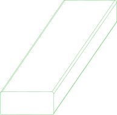
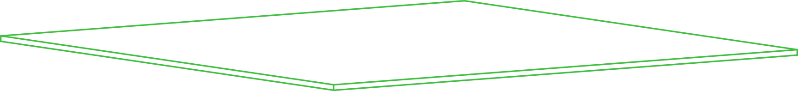

# //pub/std/imperial/dimensional-lumber

Dimensional lumber and plywood in imperial units

The standard (US) sizes of softwood dimensional lumber and plywood, as
parametric parts.

A piece of lumber is named by its **nominal** size ("2x4"): the size of the
rough-sawn board before it is dried and planed. What is sold is smaller, by
the amounts ALSC PS 20 gives -- a nominal 1 in. is 3/4 in. actual, 2 to 7
in. lose 1/2 in., and 8 in. and up lose 3/4 in. -- so a 2x4 is 1-1/2 x
3-1/2 in. and a 2x8 is 1-1/2 x 7-1/4 in. The length is not dressed: an 8 ft.
board is 96 in. long. Plywood is named by its nominal thickness and is 1/32
in. thinner than that.

The size parameters are the nominal sizes; the geometry is the actual one.
Each part also takes a `tolerance`: how precisely it is made, in
millimetres -- 1.6 (1/16 in.) for lumber and 0.8 (1/32 in.) for plywood by
default, which is what a saw cuts either to and what a part cut from it has
to be made to.

| Part      | Parameters                                                         | Frame                                                           |
|-----------|--------------------------------------------------------------------|-----------------------------------------------------------------|
| `lumber`  | `width`, `height` (nominal, in.), `length` (in.), `tolerance` (mm) | width along X, length along Y, height along Z; eased long edges |
| `plywood` | `width`, `length` (in.), `thickness` (nominal, in.), `tolerance` (mm) | width along X, length along Y, thickness along Z             |

Both have a corner at the origin, so a piece cut to length from a longer
board is in the coordinates of the board it came from.

## Ports

Both parts implement `cuboid`: the box they fill, at their actual size, with
a port at every corner and at the middle of every edge, on each face that
meets there -- 48 in all. A port's +Z is the inward normal of its face, so
two ports mate where two faces touch.

A port is named by its face and then by where on that face it is: `z1-x0-y0`
is on the top face (Z at its largest), at the corner it shares with the
X = 0 and Y = 0 faces; `z1-x0` is on the top face, at the middle of its edge
with the X = 0 face. At a corner, X and Y run along the two edges into the
face; at the middle of an edge, X points into the face and Y runs along the
edge. So:

* two corners mate with their faces flush, in the same quadrant (a board
  butted against another, flush with its end and its face);
* a corner and the middle of an edge mate with the two edges in line;
* two middles of edges mate with the edges crossed at right angles.

The long edges of `lumber` are eased, so a corner is where two faces would
meet.

```shell
pc render -t png --with-ports -p width=4 -p height=2 -p length=24 //pub/std/imperial/dimensional-lumber:lumber
```


## Usage
```shell
pc inspect -p width=4 -p height=2 -p length=96 //pub/std/imperial/dimensional-lumber:lumber
pc inspect -p thickness=0.75 //pub/std/imperial/dimensional-lumber:plywood
```

From another package, as an instance of a standard size:

```yaml
parts:
  stud:
    type: enrich
    source: //pub/std/imperial/dimensional-lumber:lumber
    with:
      width: 4
      height: 2
      length: 92.625
```

## Products

A store advertises the sizes it sells by declaring each product as an
instance of `lumber` or `plywood` (an `enrich`) with its own `vendor` and
`sku`. See
[`//pub/svc/commerce/homedepot`](https://github.com/partcad/svc-commerce-homedepot),
whose products the
[`//pub/furniture/workspace/basic`](https://github.com/partcad/partcad-furniture-basic)
desk is cut from. A part cut to length from one names that product as its
stock.


## Parts

### lumber
<table><tr>
<td valign=top><a href="lumber.py"></a></td>
<td valign=top>Softwood dimensional lumber, by its nominal size</td>
<td valign=top>Parameters:<br/><ul>
<li>width: <ul>
<li>1</li><li>2</li><li>3</li><li><b>4</b></li>
<li>5</li><li>6</li><li>8</li><li>10</li><li>12</li></ul>
</li>
<li>height: <ul>
<li>1</li><li><b>2</b></li>
<li>3</li><li>4</li><li>5</li><li>6</li><li>8</li><li>10</li><li>12</li></ul>
</li>
<li>length: 120</li>
<li>tolerance: 1.6</li>
</ul>
</td>
</tr></table>

### plywood
<table><tr>
<td valign=top><a href="plywood.py"></a></td>
<td valign=top>A plywood panel, by its nominal thickness</td>
<td valign=top>Parameters:<br/><ul>
<li>width: 48</li>
<li>length: 48</li>
<li>thickness: 0.5</li>
<li>tolerance: 0.8</li>
</ul>
</td>
</tr></table>

<br/><br/>

*Generated by [PartCAD](https://partcad.org/)*
